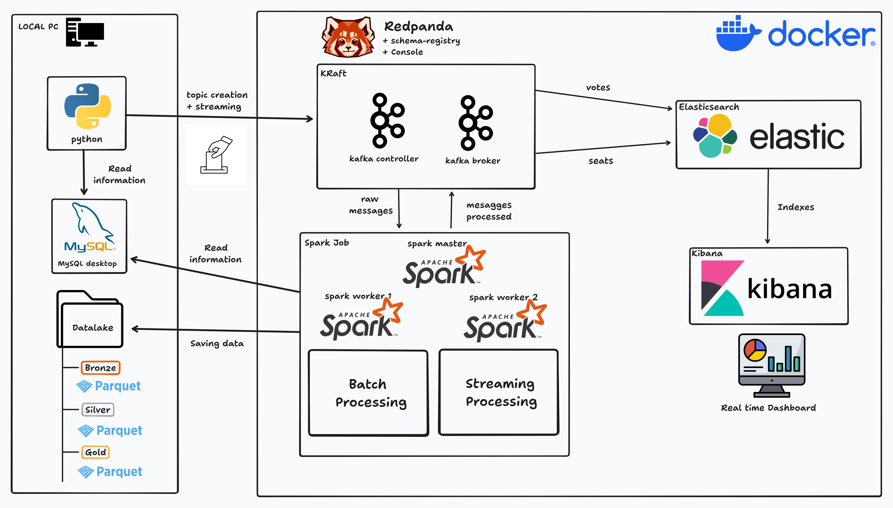

# REAL TIME END TO END BIG DATA PROJECT

This Master’s Thesis presents the design and implementation of an end-to-end Big Data architecture for real-time 
processing and visualization of electoral results in Spain, focusing exclusively on data engineering aspects.

The project simulates a nationwide electronic voting scenario by generating artificial votes that are ingested as 
events into an Apache Kafka cluster. Votes include structured information about the selected political party, 
geographic location, and timestamp, enabling spatial and temporal analysis.

The architecture follows a Lambda approach, combining real-time and batch processing with Apache Spark. Streaming
 data is validated, transformed, and stored in a Medallion-style Data Lake (Bronze, Silver, Gold), while periodic 
batch jobs compute seat allocation per province and party using the D’Hondt method.

Processed results are indexed in Elasticsearch and visualized through real-time Kibana dashboards, providing 
a scalable and up-to-date view of the simulated electoral process.

This is the architecture implemented:

These are some of the results obtained:

